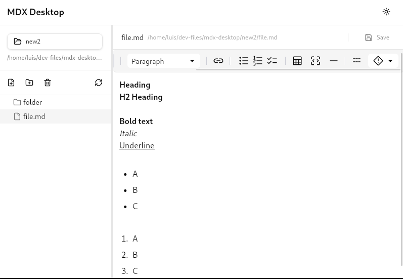

import { Card, CardGrid } from '@astrojs/starlight/components';

## Built for Performance at Scale

MDX Desktop is a native desktop application designed to handle large markdown projects efficiently. Whether you're managing 100 or 10,000+ files, MDX Desktop delivers fast, reliable performance.

## Key Features

<CardGrid stagger>
  <Card title="Lightning Fast" icon="rocket">
    Handle 1000+ markdown files efficiently with lazy loading, virtualization, and parallel file processing. Initial load of 100 files in under 200ms.
  </Card>
  
  <Card title="Native Performance" icon="star">
    Built with Tauri and Rust for native speed and minimal memory footprint. Uses less than 100MB for 10k file trees.
  </Card>
  
  <Card title="Auto-Save" icon="approve-check">
    Never lose work with intelligent 300ms debounced auto-save and atomic file operations. Your changes are always protected.
  </Card>
  
  <Card title="Real-time Sync" icon="refresh">
    File system watcher detects external changes instantly with 100ms debounced notifications. Stay in sync with your team.
  </Card>
  
  <Card title="Smart Editor" icon="pencil">
    WYSIWYG markdown editing with MDXEditor integration. Format text naturally while maintaining clean markdown syntax.
  </Card>
  
  <Card title="Secure by Design" icon="seti:lock">
    Path canonicalization and input validation prevent directory traversal attacks. Your files are safe.
  </Card>
</CardGrid>

## Experience MDX Desktop

{/* TODO: Replace with actual screenshot once available */}

A clean, distraction-free interface for editing markdown files. Navigate large projects with ease using the virtualized file tree, and edit with confidence using real-time auto-save.

## Get Started

<CardGrid>
  <Card title="Install MDX Desktop" icon="rocket">
    Download and install MDX Desktop on Windows, macOS, or Linux.
    
    [Installation Guide →](/getting-started/installation/)
  </Card>
  
  <Card title="Learn the Basics" icon="open-book">
    Get up to speed with the fundamentals in just a few minutes.
    
    [Quick Start →](/getting-started/quick-start/)
  </Card>
  
  <Card title="Explore Features" icon="star">
    Discover all the powerful features that make MDX Desktop unique.
    
    [Features →](/features/editor/)
  </Card>
  
  <Card title="Get Help" icon="information">
    Find answers to common questions and troubleshooting tips.
    
    [FAQ →](/reference/faq/)
  </Card>
</CardGrid>
